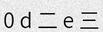
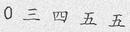

CRNN Training from Data to Model
======================================

This repo implements the Convolutional Recurrent Neural Network (CRNN) in pytorch.
Origin repo could be found in [crnn](https://github.com/bgshih/crnn)

This repo gives you a pipeline from how to generate the data, prepare the dataset and utilize the data you generate to train a crnn model.

1 Envrionment 
--------
python 3.7 & python 2.7 (in order to create lmdb dataset)
pytorch 1.3.1
opencv + pytorch + lmdb +wrap_ctc
* [warp_ctc_pytorch](https://github.com/SeanNaren/warp-ctc/tree/pytorch_bindings/pytorch_binding)

ATTENTION!

* getLmdb.py must run in python2.x
* warp_ctc_pytorch installation requires [camke](https://cmake.org/) and [nvcc](https://docs.nvidia.com/cuda/cuda-compiler-driver-nvcc/index.html)

2 Create your own data
--------
The data generator can be found in `./datasets/TextDataGenerator/`

```
cd ./datasets/TextDataGenerator/
```

For more details, you can refer to the [original repo](https://github.com/Aurora11111/TextRecognitionDataGenerator)

In this repo I only to introduce a simple way to genreate a multiligual dataset (the dictionary consists of 5 numbers, 5 latin letters and 5 chinese characters). If you want to create more complicated datasets, modify the files in `./dict/**.txt`

To generate the data, run:
```
sh run_data.sh
```
Reuslts are saved in `./out/`, here are some examples:





3 Train a new model
-----------------

1. Prepare data label

Move your training images and test images to a folder under `./datasets/`. For example: `./datasets/YOUR_DATASET_NAME`

run `./datasets/create_labels.py --data_root ./datasets/YOUR_DATASET_NAME`

Now the labels of both training and testing set will be created.
```
ls ./datasets/YOUR_DATASET_NAME
test  test.txt train  train.txt
```
Spot on txt files:
```
000ba_523.jpg 000ba
001bb_656.jpg 001bb
00aba_7.jpg 00aba
00a五五_420.jpg 00a五五
00ca一_632.jpg 00ca一
```

2. Prepare lmdb dataset

```
cd ./datasets/YOUR_DATASET_NAME
mkdir train_lmdb
mkdir test_lmdb
cd ..
conda deactivate
conda activate YOUR_PY2_ENV
python ./getLmdb.py
```
Modify the parameters in `getLmdb.py`

    # lmdb output folder
    outputPath = './datasets/YOUR_DATASET_NAME/train_lmdb' # shift to test
    # the images and labels
    imgdata = open("./datasets/YOUR_DATASET_NAME/train.txt") # shift to test

3. Train the model

`python /contrib/crnn/crnn_main.py`

For example:
```
python ./crnn_main.py --trainroot ./datasets/YOUR_DATASET_NAME/train_lmdb --valroot ./datasets/YOUR_DATASET_NAME/test_lmdb --nh 128
``` 

Run demo
----------------------------------
A demo program can be found in ``src/demo.py``. Before running the demo, download a pretrained model
from [Baidu Netdisk](https://pan.baidu.com/s/1pLbeCND) or [Dropbox](https://www.dropbox.com/s/dboqjk20qjkpta3/crnn.pth?dl=0). 
This pretrained model is converted from auther offered one by ``tool``.
Put the downloaded model file ``crnn.pth`` into directory ``data/``. Then launch the demo by:

    python demo.py

The demo reads an example image and recognizes its text content.

Example image:


Expected output:
    loading pretrained model from ./data/crnn.pth
    a-----v--a-i-l-a-bb-l-ee-- => available
